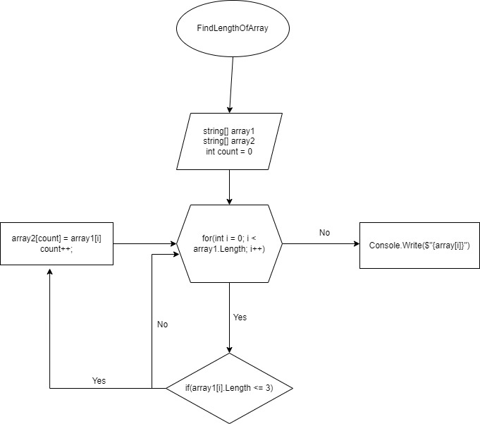

# __Задача__:

* Написать программу, которая из имеющегося массива строк формирует массив из строк, длина которых меньше либо равна 3 символа. Первоначальный массив можно ввести с клавиатуры, либо задать на старте выполнения алгоритма. При решение не рекомендуется пользоваться коллекциями, лучше обойтись исключительно массивами.

# __Алгоритм решения__:
1. Сначала объявляем два массива: изначальный(_array1_) и второй(_array2_) - такой же длины.
2. Создаём метод, в котором цикл(_for_) соразмерный длине массива.
3. Внутри цикла проверяем условия, через (_if <=3_ ), если условия выполняются, то элемент первого массива заносим в __count__(_счетчик_) элемента второго массива.
4. Переменная __count__(_счетчик_) нужна, для того, чтобы поочередно закидывать значения из первого массива во второй.
5. После присвоения, переменная __count__(_счетчик_) увеличивается на 1 и возвращается к циклу (_for_), в котором значение ( __i__ ) также увеличивается на __1__.
6. И так проверяем программу до конца.
7. Создаем метод, при помощи которого выводим в консоль наш массив.
8. Вызываем метод преобразовавший наш массив.
9. Вызываем метод вывода массива в консоль.

Графическое изображение алгоритма:

Реализация алгоритма по пути __StringArray/Program.cs__